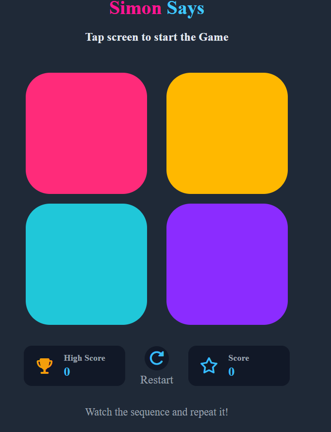

# 🎮Simon Says Game
**Live Demo:** [click here to play](https://khushi-mishra-codes.github.io/simon-says-game/)

A fun and interactive memory game built using HTML, CSS and JavaScript.
The objective is to remember and repeat the sequence of colored buttons.
As you progress, the sequence becomes longer, making the game more challenging!
---
## 🚀 Features
- 🎯 Interactive memory based gameplay
- 🎨 Clean and attractive user interface
- 🔄️ Restart game after Game over
- 🏆 High Score tracking to record your best performance
- 📊 Current score display
- 📱Responsive design for different screen sizes
---
## 🛠️ Technologies Used
- HTML5 - Page structure
- CSS3 - Styling and animations
- JavaScript(ES6) - Game logic and user interactions
---
## 🎮 How to Play
1. Tap anywhere on the screen to start the game.
2. Watch the sequence of flashing colored buttons carefully.
3. Repeat the exact sequence by clicking the buttons in order.
4. Each correct sequence advance you to the next level with a higher score.
5. If you tap the wrong button, it's Game Over!
6. Click the Restart button to play again and beat your High Score.
---
## 📷 Preview

---
